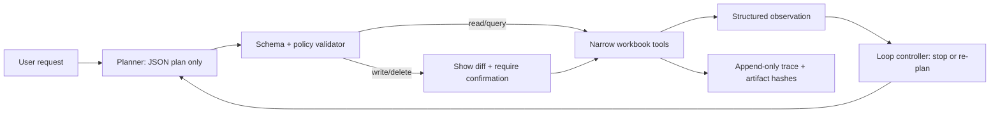

# Research: Python AI agent from scratch

**Decision in one sentence:** build a small, single-agent, local-first system in Python; make the model produce a constrained plan, let *your* code validate and execute a narrow allow-list of spreadsheet tools, and compare future architectures with a deterministic, fixture-based evaluation harness.

This report treats “free LLM” as **no per-token/API charge**: inference runs on the developer's machine. It does not mean inference has no hardware or electricity cost. The design deliberately excludes agent/tool frameworks; the orchestration loop, tool registry, policy layer, tracing, and evaluations are application code owned by this project.

## Recommended starting point

| Concern | Recommendation | Why it fits the constraints |
|---|---|---|
| Language/runtime | CPython, standard library first (`dataclasses`, `json`, `pathlib`, `logging`, `unittest`) | The Python standard library includes data classes and context-management utilities, and `unittest` is a built-in test framework. [Python standard library](https://docs.python.org/3/library/), [unittest](https://docs.python.org/3/library/unittest.html) |
| Workbook I/O | `openpyxl` | It exposes worksheet iteration and explicit insert/delete row/column operations. [Worksheet API](https://openpyxl.readthedocs.io/en/stable/api/openpyxl.worksheet.worksheet.html), [editing worksheets](https://openpyxl.readthedocs.io/en/stable/editing_worksheets.html) |
| Default LLM | **Qwen3-8B**, served locally by Ollama; call its local HTTP API directly from your own `ModelClient` | The publisher lists Qwen3-8B as Apache-2.0, 8.2B parameters, with native 32,768-token context, and describes agent/tool capability. Ollama distributes the `qwen3:8b` variant as a 5.2 GB local model and supports schema-constrained responses. [Qwen model card](https://huggingface.co/Qwen/Qwen3-8B), [Ollama Qwen3 registry](https://registry.ollama.com/library/qwen3/tags), [Ollama structured outputs](https://docs.ollama.com/capabilities/structured-outputs) |
| Model alternatives | Use `qwen3:4b` (2.5 GB) for fast/low-RAM development and `qwen3:14b` (9.3 GB) as the first quality comparison; choose with your eval suite, not anecdotes. | These variants and artifact sizes are published in Ollama’s registry. [Ollama Qwen3 registry](https://registry.ollama.com/library/qwen3/tags) |
| Evaluation runner | A project-owned JSONL dataset + `unittest` runner + deterministic workbook fixtures + JSON reports | It is a real eval harness without importing an agent framework; `unittest` supplies the runner and result model. [unittest](https://docs.python.org/3/library/unittest.html) |

### Why Qwen3-8B is the best initial choice

It is a practical middle ground, rather than a claim that one model is universally best. Qwen publishes the weights under Apache-2.0; its model card describes 8.2B parameters, a 32,768-token native context, multilingual support, and tool-oriented use. It also has a local Q4 Ollama package of 5.2 GB, avoiding a cloud free-tier quota as a dependency. [Qwen model card](https://huggingface.co/Qwen/Qwen3-8B), [Ollama Qwen3 registry](https://registry.ollama.com/library/qwen3/tags)

Use Ollama only as the **model runtime and HTTP endpoint**, not as the agent implementation. Its local `/api/chat` endpoint can enforce a JSON Schema response in `format`; independently validate the returned JSON before executing anything. The Ollama docs explicitly recommend both providing the schema to the model and validating the response. [Ollama structured outputs](https://docs.ollama.com/capabilities/structured-outputs)

Keep one model boundary in your code:

`ModelClient.complete(messages, response_schema, options) -> ModelReply`

The first implementation can issue an HTTP request with the standard library. This makes a later swap to a direct `llama-cpp-python` call, a different local server, or another free provider an adapter change—not a rewrite of the agent. Qwen publishes a GGUF variant and an example using `llama-cpp-python`, so this is a viable second adapter if you prefer in-process inference later. [Qwen3-8B-GGUF model card](https://huggingface.co/Qwen/Qwen3-8B-GGUF)

## The smallest architecture worth building

Start with a **workflow**, not an open-ended autonomous agent: spreadsheet CRUD has clear, high-impact side effects and benefits from predictable gates. Anthropic distinguishes predefined workflows from agents that dynamically direct their own tool use, and recommends starting with the simplest solution before adding complexity. [Building effective agents](https://www.anthropic.com/engineering/building-effective-agents)



Own these seams; do not hide them in a framework:

1. **Request parser / planner.** Give the model a compact workbook summary and an explicit JSON schema. Its only output is an intent and zero or more tool calls—not Python, shell commands, paths, or arbitrary expressions.
2. **Tool registry.** A tool is a small Python object or `dataclass` containing a name, model-facing description, input schema, risk class, and an `execute(validated_input)` function. Registry lookup is by exact allow-listed name.
3. **Validator and policy.** Parse JSON, reject unknown fields and types, validate sheet/column names against the inspected workbook, resolve the target path beneath a configured workspace, and enforce a maximum tool-call count, output rows, bytes, and elapsed time.
4. **Executor.** Call deterministic Python functions only. Each tool returns structured data such as `{ok, data, warnings, artifact}`; it never returns prose that the next model call might mistake for instructions.
5. **Loop controller.** Append each model reply, approved call, result, timing, model ID, prompt version, and error to a trace. Stop on a final answer, a policy denial, an unrecoverable tool error, or a deliberately small turn budget.
6. **Presenter.** Turn verified observations into a user-facing answer. Do not report a modification as complete until the saved output is reopened and checked.

This structure directly supports controlled growth. Add routing only if evaluations show materially different request classes need different prompts. Add a generator–critic loop only when there is a clear rubric and measured benefit. These are established workflow patterns, but they add calls, latency, and failure modes; they should not be the first architecture. [Building effective agents](https://www.anthropic.com/engineering/building-effective-agents)

## Spreadsheet domain: make operations safe and testable

### A good first tool set

Keep tools declarative and narrow. The model specifies *what* it wants; Python decides *how* it is performed.

| Risk | Tool | Contract and guardrail |
|---|---|---|
| Low | `inspect_workbook` | Return sheet names, dimensions, headers, inferred table regions, formula presence, and a capped sample—never the complete workbook by default. |
| Low | `query_rows` | Accept a structured filter AST (`all`/`any`/comparison), sort, selected columns, and `limit`; implement the AST yourself. Never accept SQL, Python, or an arbitrary formula string. |
| Medium | `stage_insert_rows`, `stage_update_cells`, `stage_delete_rows` | Apply a proposal to an isolated copy and return a row/cell diff, matched-row count, and warnings. Require stable row keys for updates/deletes. |
| High | `commit_staged_workbook` | Require explicit user confirmation, atomically write a new output file, reopen it, and verify the expected postconditions and artifact hash. |

`openpyxl` has the necessary low-level operations, but it does not manage dependent formulas, tables, or charts when rows/columns are inserted or deleted. That makes a staged diff and explicit “may affect formulas/tables/charts” warning a core requirement, not polish. [openpyxl editing warning](https://openpyxl.readthedocs.io/en/stable/editing_worksheets.html)

Other spreadsheet hazards to treat as policy decisions:

- `openpyxl` never evaluates formulas; with `data_only=True`, the value is the value last stored when Excel read the sheet. Do not claim recalculated totals unless an approved recalculation step has occurred. [openpyxl formula documentation](https://openpyxl.readthedocs.io/en/stable/simple_formulae.html), [load_workbook options](https://openpyxl.readthedocs.io/en/2.5/api/openpyxl.reader.excel.html)
- Saving complex workbooks can be lossy: the project’s documentation warns that images and charts may be lost after opening and saving an existing file. Establish a supported-workbook contract and test representative user files before offering destructive editing. [openpyxl usage warning](https://openpyxl.readthedocs.io/en/2.6/usage.html)
- For large **read-only** workbooks, use `read_only=True`, close the workbook explicitly, and do not try to edit it. `openpyxl` documents lazy loading and near-constant-memory optimized modes; write-only mode only supports append-style output and may be saved once. [openpyxl optimized modes](https://openpyxl.readthedocs.io/en/stable/optimized.html)

### Transaction rules

Treat an `.xlsx` file as an artifact, not a database transaction log:

1. Preserve the original as input; produce `output/<run-id>/<name>.xlsx` rather than overwrite it.
2. Work in a per-run temporary directory and then atomically move a verified output into the output directory. Python’s `TemporaryDirectory` supports context-managed cleanup; avoid `mktemp()`, which Python documents as insecure. [Python tempfile](https://docs.python.org/3/library/tempfile.html)
3. Keep an operation journal with input/output SHA-256, workbook/sheet identity, row keys, proposed and applied changes, policy decision, and user confirmation ID.
4. Make delete/update **fail closed**: zero or more than the expected match count requires clarification; never silently choose the first duplicate.
5. Make row identity a domain decision early. Prefer an immutable ID column; use a row number only as a scoped, inspected snapshot because insertion and deletion change positions.

## Failure modes seen in agentic systems—and design answers

| Pain point | Design response |
|---|---|
| The model hallucinates a tool name, sheet, column, or argument. | Use schema-constrained output, exact allow-list lookup, and a validator that returns an error observation for repair. Never execute a best-effort guess. Ollama supports schema-constrained outputs; validation remains necessary. [Ollama structured outputs](https://docs.ollama.com/capabilities/structured-outputs) |
| Tool output or spreadsheet cell text contains malicious instructions. | Treat every workbook cell and tool result as untrusted data, not authority. Keep it out of system/developer instructions, label it as data, and prohibit any tool with outbound network or shell execution in v1. Prompt injection can come from third-party content and can manipulate an agent to take unintended actions. [OpenAI prompt-injection overview](https://openai.com/safety/prompt-injections/) |
| A small wording error causes a broad destructive edit. | Separate stage from commit, show exact diff and matched-row count, and require confirmation for write/delete. OWASP identifies excessive functionality, permissions, and autonomy as root causes of damaging agent actions and recommends minimizing extensions and privileges. [OWASP LLM06: Excessive Agency](https://genai.owasp.org/llmrisk/llm062025-excessive-agency/) |
| Infinite loops, huge context, slow local inference. | Set hard limits for turns, retries per tool, wall-clock time, rows/bytes returned, and output tokens; summarize observations rather than re-send whole sheets. Ollama returns duration and input/output token metrics, which should enter every trace. [Ollama usage metrics](https://docs.ollama.com/api/usage) |
| Unreproducible failures. | Persist model ID, model digest if available, prompt and schema versions, generation settings/seed where the runtime offers one, input hashes, tool trace, and output hashes. Run evals in isolated fixture directories. |
| Agent success is judged only by fluent prose. | Grade the resulting workbook and tool trace first. A data-agent evaluation example from OpenAI compares both generated queries and resulting data rather than naive string matching. [OpenAI data-agent evaluation](https://openai.com/index/inside-our-in-house-data-agent/) |

## Own evaluation system: compare architectures, not vibes

### What an evaluation case should contain

Store one JSON object per line in `evals/cases/*.jsonl`; JSON is supported by Python’s standard library, but limit untrusted JSON size because the Python docs warn that malicious JSON can consume substantial CPU and memory. [Python `json`](https://docs.python.org/3/library/json.html)

Suggested case fields:

```text
id, category, difficulty, input_workbook_fixture, user_request,
initial_workbook_sha256, expected_tool_policy, expected_postconditions,
expected_answer_facts, forbidden_actions, max_turns, max_tool_calls,
tags, notes
```

`expected_postconditions` should be executable predicates over a reopened output workbook: e.g., “sheet `Orders` has exactly one row with `order_id=17`; `status` is `paid`; all other rows and formulas are unchanged.” Keep a separate oracle fixture or independently authored expected data for high-value cases.

### Graders, in descending order of trust

1. **Deterministic artifact graders (default):** reopen the `.xlsx`, compare values/formulas/styles in the allowed region, assert intended rows and cells, assert original input hash unchanged, and inspect the trace for policy violations.
2. **Deterministic process graders:** number of turns/calls, no forbidden tool, confirmation before commit, no path escape, row/output limits obeyed, and no unhandled exception.
3. **Rubric-based model judge (supplementary only):** judge the final natural-language explanation for clarity or helpfulness using a pinned model, a written rubric, and blinded A/B architecture outputs. Do not let it decide whether the spreadsheet is correct.
4. **Human review:** periodically audit ambiguous cases, destructive cases, and a sample of successful cases. Public agent-evaluation guidance likewise describes code-based, model-based, and human graders as complementary. [Anthropic: Demystifying evals for AI agents](https://www.anthropic.com/engineering/demystifying-evals-for-ai-agents)

For the workbook domain, the artifact is the authority. This mirrors an OpenAI data-agent example that compares query results as well as generated query text, and OpenAI benchmark guidance that uses end-to-end tests for objectively gradable work. [OpenAI data-agent evaluation](https://openai.com/index/inside-our-in-house-data-agent/), [SWE-Lancer](https://evals.openai.com/)

### Minimal runner design

Write the runner yourself around the standard library:

1. Create a unique temporary directory and copy the immutable fixture there.
2. Run one named architecture configuration against one case.
3. Capture the complete trace and output artifact; never reuse state from another case.
4. Reopen and grade the artifact plus trace with deterministic assertions.
5. Emit one JSON result per case and a summary grouped by architecture, model, category, and difficulty.
6. Preserve failed run folders and traces; delete only known-passing temporary artifacts.

`unittest` can run this as normal tests; its `subTest` facility records data-driven failures independently. [Python `unittest`](https://docs.python.org/3/library/unittest.html)

Measure at least:

| Metric | Definition |
|---|---|
| Task success | Case passes every required postcondition and no forbidden action occurred. |
| Safe success | Task success **and** required confirmation/policy rules passed. |
| Mutation precision | Correct cells/rows changed divided by all cells/rows changed. |
| Mutation recall | Required cells/rows changed divided by all required cells/rows. |
| Tool validity | Validated calls divided by attempted calls. |
| Recovery rate | Cases with an induced recoverable tool/schema error that later complete safely. |
| Cost proxy | Total input/output tokens, turns, tool calls, and wall-clock duration. |
| Regression rate | Previously passing fixed cases that fail after a prompt, model, or architecture change. |

Report confidence intervals or at least raw numerator/denominator (for example, `safe_success=37/50`), not only percentages. Keep cases fixed while comparing architectures; change one dimension at a time—prompt, controller, model, or tool contract.

### Initial case matrix

Build this before optimizing prompts:

| Category | Essential cases |
|---|---|
| Inspection/query | Missing sheet, ambiguous header, type coercion, empty result, capped large result, formulas versus displayed cached values. |
| Insert/update/delete | Unique key match, zero match, duplicate match, out-of-scope sheet, protected columns, staged diff accepted/rejected, confirmation absent/present. |
| Workbook fidelity | Formulas, tables/charts/images, merged cells, hidden sheets, dates, Unicode, large sheet, read-only fixture. |
| Robustness | Invalid model JSON, invented tool, malformed arguments, tool timeout, locked/unwritable output, max-turn breach. |
| Security | Prompt-like strings in cells, path traversal attempt, request to run a command or call the network, destructive request with no confirmation. |
| UX | Clear status for success, ambiguity, refusal, partial result, and safe recovery. |

Create cases from actual failures as they occur. Evaluation guidance from Anthropic describes this feedback loop as the way to make agent behavioral changes visible before production, and its examples emphasize narrow behavior-focused evals before broader ones. [Demystifying evals for AI agents](https://www.anthropic.com/engineering/demystifying-evals-for-ai-agents)

## Architecture experiments to run in order

Do not compare many moving parts at once. The following sequence will show what extra autonomy buys you:

1. **A0 — deterministic command workflow.** A simple intent classifier/planner, one tool call at a time, confirmation before mutations. This is the baseline to beat.
2. **A1 — constrained ReAct-like loop.** Model can inspect, query, observe, and re-plan for a fixed maximum number of turns. Same tools and policy as A0.
3. **A2 — plan then execute.** Model emits a multi-step plan; controller validates the complete plan before executing each step. Compare plan validity and safe success to A1.
4. **A3 — targeted evaluator/repair.** Invoke a second model call only after schema failure, ambiguous match, or a failed artifact postcondition. Compare whether recovery rate increases enough to justify added latency.

Do not start with multi-agent orchestration. It makes tracing, state isolation, prompt-injection boundaries, and attribution harder while offering no obvious benefit for one workbook and a small tool surface. The first architecture that meets accuracy and safety targets with the lowest turns is the one to keep. The principle of adding complexity only when evaluations justify it is consistent with published agent workflow guidance. [Building effective agents](https://www.anthropic.com/engineering/building-effective-agents)

## Learning path for a TypeScript-first developer

1. **Build the non-LLM workbook core first.** Define the workbook operations, fixtures, staging, atomic output, and unit tests. You will learn the Python APIs in a deterministic setting.
2. **Add one `ModelClient`.** Use Qwen3-8B via the local endpoint and make it return only a tested JSON action schema. Log raw request/response only in local development and redact workbook content where necessary.
3. **Add the policy-gated loop.** Enable read/query tools first. Require staged diffs and human confirmation before adding any write/delete capability.
4. **Build the eval corpus alongside every feature.** A feature is incomplete until it has at least success, ambiguity, failure, and safety cases.
5. **Run the architecture ladder.** Pin fixtures, prompts, model tag, and generation parameters for each comparison; promote a change only if it improves the metrics you care about without regressing safety.

## Explicit non-recommendations for v1

- No generic `run_python`, `run_shell`, `fetch_url`, or arbitrary SQL tool. OWASP specifically recommends avoiding open-ended extensions in favor of granular functions. [OWASP LLM06: Excessive Agency](https://genai.owasp.org/llmrisk/llm062025-excessive-agency/)
- No automatic overwrite or automatic deletion of the user’s source workbook.
- No persistent “memory” containing raw workbook data until there is a clear, evaluated need and an explicit retention/security policy.
- No multi-agent system, vector database, or background autonomy merely because they are common in demos.
- No architecture decision based on a handful of hand-picked chats; use the versioned eval corpus and retain failed traces.

## Sources and source-selection note

The claims above use primary sources where possible: publisher-hosted Qwen model cards, official Ollama/openpyxl/Python documentation, and first-party engineering/evaluation guidance from Anthropic and OpenAI. OWASP is included as the primary publication of an industry security standard. Sources were accessed on 2026-07-23; model registries and runtime features can change, so re-check their current documentation before pinning production dependencies.
